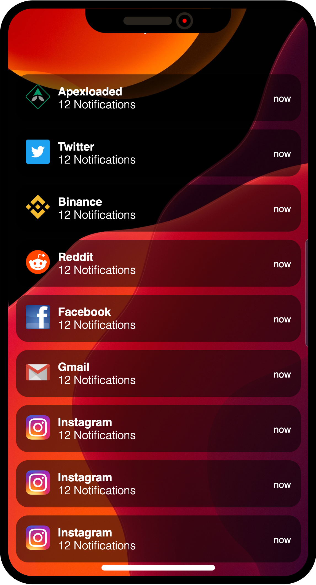

## iPhone Clone Starter File

Let's build an iphone clone with html and css as seen above, kindly clone the repo to get started with the project.

- HTML.
- CSS.

## About Us

[Apexloaded](https://apexloaded.com) is a Global Pioneer in providing IT Consults and Custom Software Development, we armed at raising world class Tech legends across the globe.

### Contact
To learn more about us, contact us using the following handle:

- **[Apexloaded.com](https://apexloaded.com/) - Website**
- **[Twitter.com](https://twitter.com/apexlaoded) - Twitter**
- **[Facebook.com](https://facebook.com/apexloaded) - Facebook**
- **[Instagram.com](https://instagram.com/officialapexloaded) - Instagram**
- **[info@apexloaded.com](mailto:info@apexloaded.com) - Email**